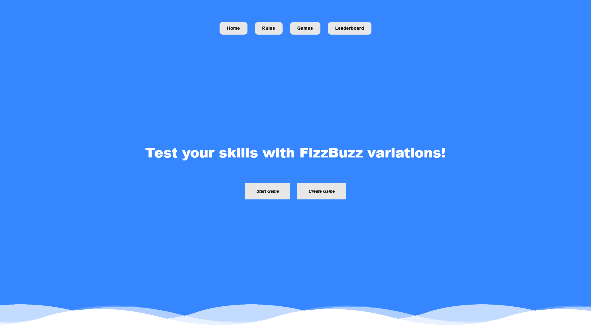
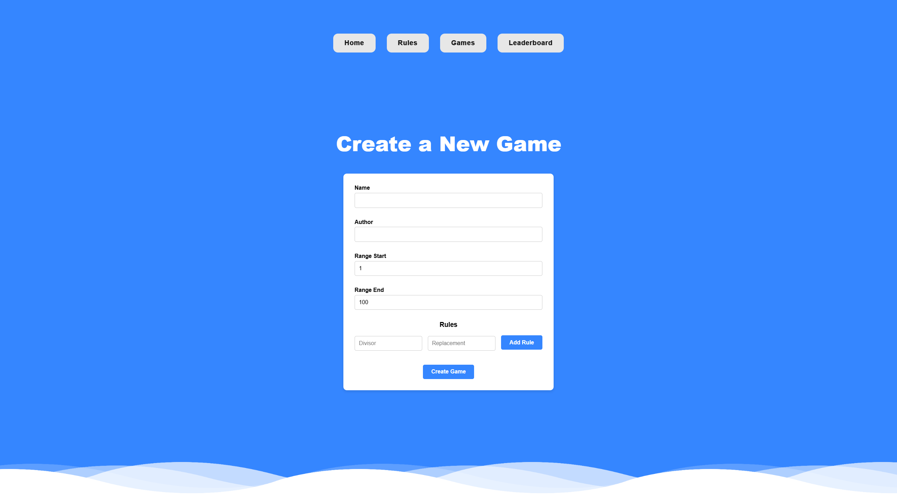
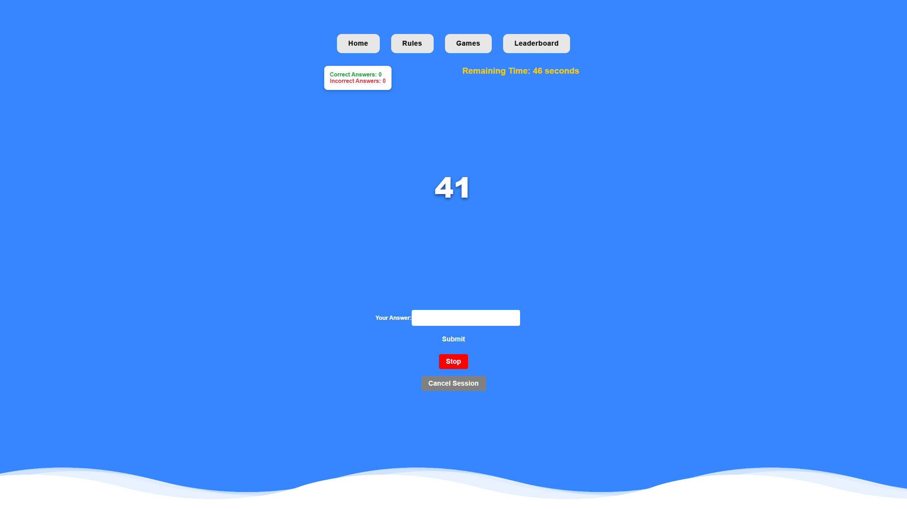

# FizzBuzz Game Application

A full-stack application built using **React** (frontend), **ASP.NET Core** (backend), and **PostgreSQL** (database). This project allows users to play and manage FizzBuzz games, track their progress, and view leaderboards.

---

## Table of Contents
- [Features](#features)
- [Tech Stack](#tech-stack)
- [Setup and Installation](#setup-and-installation)
- [Running the Application](#running-the-application)
- [API Endpoints](#api-endpoints)
- [Project Structure](#project-structure)
- [License](#license)

---

## Features
- Create and play FizzBuzz games with custom rules.
- Track user sessions, scores, and progress.
- View leaderboards.
- Backend APIs for game and session management.
- Responsive frontend built with React.

---

## Screenshots
### Homepage


### Create new Game


### Game Session


---

## Tech Stack
- **Frontend**: React, TypeScript, Axios
- **Backend**: ASP.NET Core, Entity Framework Core
- **Database**: PostgreSQL
- **Other**: Docker, Docker Compose

---

## Setup and Installation

### Prerequisites
Ensure you have the following installed:
- [Node.js](https://nodejs.org/)
- [Docker](https://www.docker.com/)
- [Docker Compose](https://docs.docker.com/compose/)
- [.NET SDK](https://dotnet.microsoft.com/download)

### Cloning the Repository
```bash
git clone dqduong2003/FizzBuzzVariation
cd FizzBuzzVariation
```

### Install Frontend Dependencies
Navigate to the `frontend` folder and install dependencies:
```bash
cd frontend
npm install
```

---

## Running the Application

### Using Docker Compose
1. Ensure Docker and Docker Compose are installed and running.
2. Build and run the services:
   ```bash
   docker-compose up --build
   ```
3. Access the application:
   - Frontend: [http://localhost:3000](http://localhost:3000)
   - Backend: [http://localhost:5000](http://localhost:5000)
---

## API Endpoints

### Game Management
- `GET /api/Game`: Get all games.
- `POST /api/Game`: Create a new game.

### Session Management
- `POST /api/Session/start-session/{gameId}`: Start a new session.
- `GET /api/Session/active-session/{sessionId}`: Get details of an active session.
- `PUT /api/Session/submit`: Submit an answer for a session.
- `GET /api/Session/generate-random/{sessionId}`: Generate a random number for a session.
- `GET /api/Session/cancel/{sessionId}`: Cancel a session.

---

## Project Structure

```plaintext
fizzbuzz-game/
├── frontend/           # React frontend
├── backend/            # ASP.NET Core backend
├── docker-compose.yml  # Docker Compose configuration
└── README.md           # Project documentation
```

---

## License
This project is licensed under the MIT License. See the LICENSE file for details.

